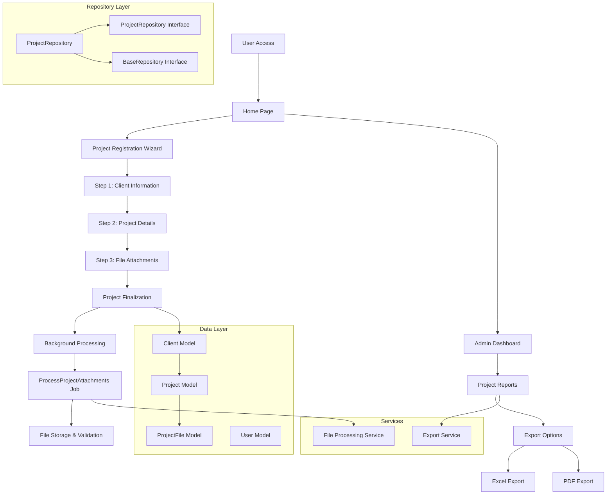

# Client Project Management System

A comprehensive Laravel-based project management application designed to streamline client project workflows, from registration to reporting and file management.

## 🚀 Features

- **Project Registration Wizard**: Multi-step project registration process with client information
- **Client Management**: Complete client database with contact information and industry tracking
- **File Management**: Secure project file uploads and attachments with background processing
- **Admin Dashboard**: Comprehensive project reporting and analytics
- **Export Capabilities**: Excel and PDF export functionality for project reports
- **Repository Pattern**: Clean architecture with repository interfaces for data access
- **Modern UI**: Built with Inertia.js, Vue.3, and Tailwind CSS for a seamless user experience

## 🏗️ Architecture

### Tech Stack
- **Backend**: Laravel 12.x (PHP 8.2+)
- **Frontend**: Vue.3 with Inertia.js
- **Styling**: Tailwind CSS 4.0
- **Build Tool**: Vite
- **Database**: MySQL/PostgreSQL (configurable)
- **File Processing**: Laravel Queues with background job processing

### Key Dependencies
- **Laravel Breeze**: Authentication scaffolding
- **Inertia.js**: Modern monolithic development
- **DomPDF**: PDF generation for reports
- **Maatwebsite Excel**: Excel export functionality
- **Heroicons**: Beautiful SVG icons

## 📊 Application Flow Diagram



## 🗂️ Project Structure

```
app/
├── Exports/           # Excel export classes
├── Http/
│   ├── Controllers/   # Application controllers
│   └── Requests/      # Form request validation
├── Jobs/              # Background job processing
├── Models/            # Eloquent models
├── Providers/         # Service providers
├── Repositories/      # Repository pattern implementation
└── Services/          # Business logic services

resources/
├── js/               # Vue.js components and pages
├── css/              # Tailwind CSS styles
└── views/            # Blade templates (if any)

database/
├── migrations/       # Database schema migrations
├── seeders/          # Database seeders
└── factories/        # Model factories

routes/
├── web.php           # Web routes
└── console.php       # Artisan commands
```

## 🛠️ Installation

### Prerequisites
- PHP 8.2 or higher
- Composer
- Node.js & npm
- MySQL/PostgreSQL database

### Setup Steps

1. **Clone the repository**
   ```bash
   git clone <repository-url>
   cd client-project-management
   ```

2. **Install PHP dependencies**
   ```bash
   composer install
   ```

3. **Install Node.js dependencies**
   ```bash
   npm install
   ```

4. **Environment configuration**
   ```bash
   cp .env.example .env
   php artisan key:generate
   ```

5. **Database setup**
   ```bash
   # Configure database settings in .env
   php artisan migrate
   php artisan db:seed
   ```

6. **Build assets**
   ```bash
   npm run build
   ```

## 🚦 Development

### Running the Application

**Full development environment:**
```bash
npm run dev:full
```
This starts:
- Laravel development server (port 8000)
- Queue worker
- Laravel Pail for real-time logs
- Vite development server (port 5174)

**Individual services:**
```bash
# API server only
npm run dev:api

# Frontend only
npm run dev:web

# Build for production
npm run build
```

### Key Routes

- **Home**: `/` - Landing page
- **Project Registration**: `/projects/register` - Multi-step project wizard
- **Admin Dashboard**: `/admin/projects` - Project management interface
- **Excel Export**: `/admin/projects/export/excel`
- **PDF Export**: `/admin/projects/export/pdf`

## 📋 Database Schema

### Core Models

**Client**
- `id`, `name`, `email`, `phone`, `industry`
- Relationship: `hasMany(Project)`

**Project**
- `id`, `client_id`, `project_name`, `project_type`, `start_date`, `end_date`, `estimated_budget`, `description`
- Relationships: `belongsTo(Client)`, `hasMany(ProjectFile)`

**ProjectFile**
- `id`, `project_id`, `filename`, `file_path`, `file_size`
- Relationship: `belongsTo(Project)`

## 🔧 Key Features Implementation

### Repository Pattern
The application uses the Repository pattern for clean data access:
- `BaseRepositoryInterface` - Common repository methods
- `ProjectRepositoryInterface` - Project-specific methods
- Dependency injection for testability

### Background Processing
File uploads are processed asynchronously using Laravel Queues:
- `ProcessProjectAttachments` job handles file processing
- Improves user experience for large file uploads

### Export System
Flexible export system supporting multiple formats:
- Excel exports using Maatwebsite Excel
- PDF generation with DomPDF
- Configurable report templates

## 🧪 Testing

```bash
# Run all tests
php artisan test

# Run specific test suite
php artisan test --testsuite=Feature
```

## 📝 Contributing

1. Fork the repository
2. Create a feature branch (`git checkout -b feature/amazing-feature`)
3. Commit your changes (`git commit -m 'Add amazing feature'`)
4. Push to the branch (`git push origin feature/amazing-feature`)
5. Open a Pull Request

## 📄 License

This project is licensed under the MIT License - see the [LICENSE](LICENSE) file for details.

## 🤝 Support

For support and questions, please contact the development team or create an issue in the repository.

## Code of Conduct

In order to ensure that the Laravel community is welcoming to all, please review and abide by the [Code of Conduct](https://laravel.com/docs/contributions#code-of-conduct).

## Security Vulnerabilities

If you discover a security vulnerability within Laravel, please send an e-mail to Taylor Otwell via [taylor@laravel.com](mailto:taylor@laravel.com). All security vulnerabilities will be promptly addressed.

## License

The Laravel framework is open-sourced software licensed under the [MIT license](https://opensource.org/licenses/MIT).